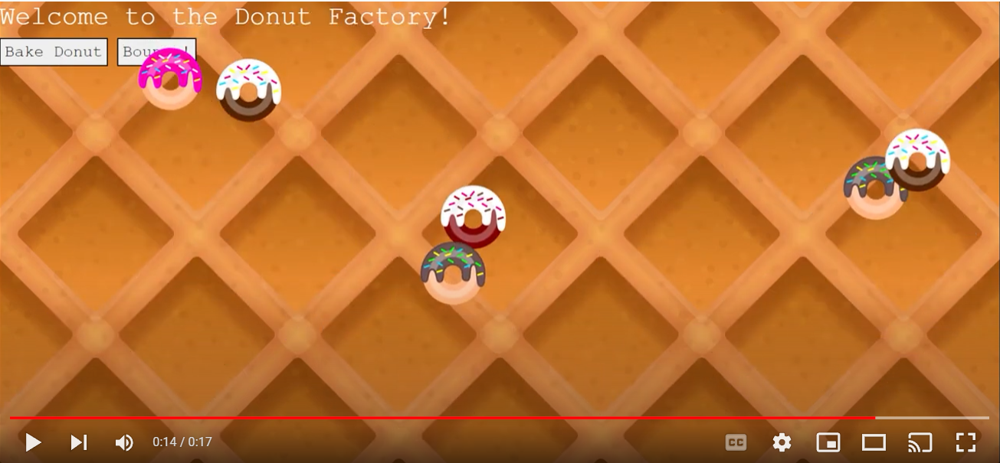

# Donut Factory

## Project Description: 

Factory for making donuts and then bounce them around the waffle-cone screen. Used the Pacmen starter.html code provided by John Williams at MIT. Replaced pacmen with donuts. Donuts SVGs were created by me using Inkscape. Changed code so random donut would be created out of those listed in array, rather than only one image.

## What does the current project do? 

When button "Bake Donut" is pressed, one out of four possible donut flavors will display on screen. Multiple can be "baked" before evoking them to bounce around the screen. They will move at different speeds. The more you press the "Bounce" button the faster they go.

## How to Run: 
*Clone the repository
*Run the starter.html file
*Click Bake Donut (as many times as you'd like)
*Click Bounce to make them move
*Clicking bounce multiple times will make them move faster with each click.

## Roadmap of future improvements: 
*Prevent donuts from being created on top of buttons.

## License information: 
[MIT License](https://github.com/LJaquez/GLTECH-Bus-Map/blob/main/LICENSE)

