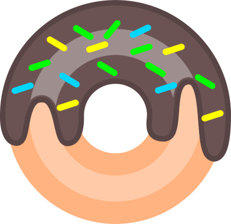

# Donut Factory
Factory for making donuts and then bounce them around the waffle-cone screen.

Used the Pacmen starter.html code provided by John Williams at MIT.

Donuts SVGs were created by me using Inkscape.

When button "Bake Donut" is pressed, one out of four possible donut flavors will display on screen. Multiple can be "baked" before evoking them to bounce around the screen. They will move at different speeds. The more you press the "Bounce Button" the faster they go.

